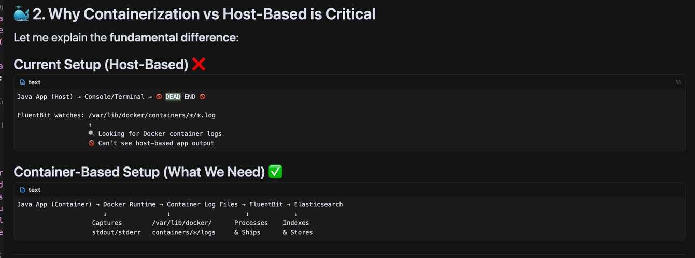

# 📝 **COMPLETE LOGS FLOW DOCUMENTATION**

## **🎯 System Overview**

This document explains the **complete end-to-end logs flow** in our telemetry learning project, including all configurations, issues encountered, and solutions implemented.

---

## **🏗️ ARCHITECTURE: Complete Logs Pipeline**

```
┌─────────────────────────────────────────────────────────────────────┐
│                    ☕ JAVA APPLICATION                               │
│  ┌─────────────────┐    ┌─────────────────┐    ┌─────────────────┐  │
│  │   UserService   │    │  OrderService   │    │   TelemetryApp  │  │
│  │ Creates users   │    │ Processes orders│    │  HTTP endpoints │  │
│  │ Logs: INFO/DEBUG│    │ Logs: WARN/INFO │    │ Logs: trace IDs │  │
│  └─────────────────┘    └─────────────────┘    └─────────────────┘  │
│           │                       │                       │          │
│           └───────────────────────┼───────────────────────┘          │
│                                   │                                  │
│  📝 LOGBACK CONFIGURATION: Structured Console Logging               │
│  Format: timestamp [thread] LEVEL logger [traceId=X] - message      │
│  Output: stdout/stderr ONLY (cloud-native best practice)            │
└─────────────────────────────────┬───────────────────────────────────┘
                                  │
                                  ▼
┌─────────────────────────────────────────────────────────────────────┐
│                    🐳 DOCKER CONTAINER RUNTIME                      │
│                                                                     │
│  ⚠️  CRITICAL ISSUE DISCOVERED:                                     │
│  📍 FluentBit can ONLY capture logs from DOCKER CONTAINERS         │
│  📍 Host-based applications are INVISIBLE to FluentBit             │
│                                                                     │
│  📂 Container logs stored at:                                      │
│  /var/lib/docker/containers/[container-id]/[container-id]-json.log │
│                                                                     │
│  🔍 Log format (JSON):                                             │
│  {"log":"actual log message","stream":"stdout","time":"ISO8601"}   │
└─────────────────────────────────┬───────────────────────────────────┘
                                  │
                                  ▼
┌─────────────────────────────────────────────────────────────────────┐
│               🌊 FLUENTBIT v4.0.11 (LOG PROCESSOR)                  │
│                                                                     │
│  📋 CONFIGURATION: fluent-bit.yaml (YAML FORMAT)                   │
│  ✅ Upgraded from v2.2.0 → v4.0.11 for YAML parser support        │
│                                                                     │
│  🔄 PROCESSING PIPELINE:                                           │
│  1️⃣ INPUT:  tail /var/lib/docker/containers/*/*.log               │
│  2️⃣ FILTER: grep container_name /.*telemetry.*/                   │
│  3️⃣ FILTER: parser java_simple (extract fields)                   │
│  4️⃣ FILTER: modify (add service metadata)                         │
│  5️⃣ OUTPUT: elasticsearch:9200                                    │
│                                                                     │
│  🔍 PARSERS (Inline YAML - v3.2+ feature):                        │
│  - docker: JSON parser for container logs                          │
│  - java_simple: Regex parser for Java structured logs             │
│  - java_structured: Full parser with trace correlation             │
└─────────────────────────────────┬───────────────────────────────────┘
                                  │
                                  ▼
┌─────────────────────────────────────────────────────────────────────┐
│                   🔍 ELASTICSEARCH (LOG STORAGE)                    │
│                                                                     │
│  📊 INDEX PATTERN: telemetry-logs-YYYY.MM.DD                       │
│  🏷️  FIELDS EXTRACTED:                                              │
│  - @timestamp: ISO8601 timestamp                                   │
│  - level: INFO, DEBUG, WARN, ERROR                                 │
│  - logger: com.telemetrylearning.service.UserService              │
│  - thread: HTTP-Dispatcher, main                                   │
│  - traceId: distributed tracing correlation                        │
│  - message: actual log content                                     │
│  - service: telemetry-learning-production                          │
│  - environment: development                                        │
│                                                                     │
│  🔍 FULL-TEXT SEARCH: Query logs by any field                      │
│  📈 TIME-SERIES: Automatic retention and optimization              │
└─────────────────────────────────┬───────────────────────────────────┘
                                  │
                                  ▼
┌─────────────────────────────────────────────────────────────────────┐
│                    📊 KIBANA (LOG ANALYTICS UI)                     │
│                                                                     │
│  🌐 WEB INTERFACE: http://localhost:5601                           │
│  🔍 SEARCH CAPABILITIES:                                           │
│  - Search by traceId: traceId:"abc123456789"                      │
│  - Filter by level: level:"ERROR"                                  │
│  - Time range queries: @timestamp:[now-1h TO now]                  │
│  - Business context: userId:"user-123" AND orderId:"order-456"     │
│                                                                     │
│  📊 DASHBOARDS: Visual log analysis and monitoring                 │
│  🚨 ALERTING: Custom alerts based on log patterns                  │
└─────────────────────────────────────────────────────────────────────┘
```

---

## **🔧 DETAILED CONFIGURATION FILES**

### **1. 📝 LOGBACK CONFIGURATION (`src/main/resources/logback.xml`)**

```xml
<?xml version="1.0" encoding="UTF-8"?>
<configuration>
    
    <!-- 🌐 CLOUD-NATIVE CONSOLE LOGGING ONLY -->
    <!-- 
    ✅ BEST PRACTICE: Let container orchestrators handle log aggregation
    ❌ AVOID: Writing logs to files (creates I/O bottlenecks)
    -->
    
    <!-- 📺 Structured Console Output for Production -->
    <appender name="CONSOLE" class="ch.qos.logback.core.ConsoleAppender">
        <encoder class="ch.qos.logback.classic.encoder.PatternLayoutEncoder">
            <!-- 
            🎯 STRUCTURED LOG FORMAT:
            - timestamp: For chronological ordering
            - [thread]: Which thread generated the log
            - level: INFO, DEBUG, WARN, ERROR for filtering
            - logger: Full class name for debugging
            - [traceId]: Distributed tracing correlation (MDC)
            - [spanId]: Specific operation correlation (MDC)
            - [userId]: Business context for user actions (MDC)
            - [orderId]: Business context for order operations (MDC)
            - message: Actual log content
            -->
            <pattern>%d{yyyy-MM-dd HH:mm:ss.SSS} [%thread] %-5level %logger{36} [traceId=%X{traceId:-}] [spanId=%X{spanId:-}] [userId=%X{userId:-}] [orderId=%X{orderId:-}] - %msg%n</pattern>
        </encoder>
    </appender>
    
    <!-- 🎯 Business Context Logger: High-value events -->
    <!-- 
    INFO level: Important business operations (user creation, orders)
    Captures: Service layer operations that matter for business analytics
    -->
    <logger name="com.telemetrylearning.service" level="INFO" additivity="false">
        <appender-ref ref="CONSOLE"/>
    </logger>
    
    <!-- 🗄️ Repository Layer: Database operations -->
    <!-- 
    DEBUG level: Detailed database interactions for troubleshooting
    Captures: SQL execution, row counts, database performance
    -->
    <logger name="com.telemetrylearning.repository" level="DEBUG" additivity="false">
        <appender-ref ref="CONSOLE"/>
    </logger>
    
    <!-- 🔍 Telemetry Layer: Observability internals -->
    <!-- 
    INFO level: Tracing and metrics operations
    Captures: Span creation, metric recording, telemetry health
    -->
    <logger name="com.telemetrylearning.telemetry" level="INFO" additivity="false">
        <appender-ref ref="CONSOLE"/>
    </logger>
    
    <!-- 🏭 Factory Classes -->
    <logger name="com.telemetrylearning.factory" level="INFO" additivity="false">
        <appender-ref ref="CONSOLE"/>
    </logger>
    
    <!-- 🔇 External Library Noise Reduction -->
    <!-- 
    Suppress verbose logging from third-party libraries
    Only show ERROR level to catch actual problems
    -->
    <logger name="io.opentelemetry" level="ERROR"/>
    <logger name="com.mysql" level="WARN"/>
    <logger name="org.springframework" level="WARN"/>
    <logger name="com.zaxxer.hikari" level="WARN"/>
    
    <!-- 🌍 Root Logger: Console-only for cloud-native architecture -->
    <root level="INFO">
        <appender-ref ref="CONSOLE"/>
    </root>
    
</configuration>
```

**🔍 Key Logback Features:**
- **MDC Integration**: Automatic traceId, spanId correlation
- **Structured Format**: Machine-parseable log format
- **Console Only**: No file I/O for cloud-native deployments
- **Level Control**: Different log levels for different packages
- **Noise Reduction**: Suppress verbose third-party libraries

---

### **2. 🌊 FLUENTBIT CONFIGURATION (`config/fluentbit/fluent-bit.yaml`)**

```yaml
# 🌊 FLUENTBIT FULL YAML CONFIGURATION (v4.0.11)
# 
# ⚠️  CRITICAL DISCOVERY:
# FluentBit v2.2.0 did NOT support YAML parsers
# FluentBit v3.2+ has full YAML support including inline parsers
# We upgraded to v4.0.11 to get complete YAML functionality

service:
    # 🔄 FLUSH CONFIGURATION
    # flush: 1 means flush logs every 1 second (low latency)
    # Higher values = better performance, higher latency
    flush: 1
    
    # 📊 LOG LEVEL for FluentBit itself
    # debug: Show all internal FluentBit operations
    # info: Normal operational logs (recommended)
    log_level: info
    
    # 🚀 DAEMON MODE
    # false: Run in foreground (better for containers)
    # true: Run in background (for traditional deployments)
    daemon: false

# 🔍 PARSERS: Define directly in main config (v3.2+ feature)
# 
# 💡 MAJOR IMPROVEMENT: No separate parsers.conf file needed!
# All parsers defined inline for better maintainability
parsers:
    # 🐳 Docker JSON parser
    # 
    # PURPOSE: Parse Docker container log format
    # INPUT:  {"log":"actual message","stream":"stdout","time":"2025-10-03T18:00:36.755Z"}
    # OUTPUT: log="actual message", time=parsed_timestamp
    - name: docker
      format: json
      time_key: time
      time_format: '%Y-%m-%dT%H:%M:%S.%L'
      time_keep: true

    # ☕ Java application log parser (simple version)
    # 
    # PURPOSE: Extract fields from Java structured logs
    # INPUT:  "2025-10-03 18:00:36.755 [HTTP-Dispatcher] INFO c.t.service.UserService [traceId=abc123] - Creating user: alice"
    # OUTPUT: timestamp, thread, level, logger, traceId, message
    - name: java_simple
      format: regex
      regex: '^(?<timestamp>\d{4}-\d{2}-\d{2} \d{2}:\d{2}:\d{2}\.\d{3}) \[(?<thread>[^\]]+)\] (?<level>\w+)\s+(?<logger>[^\s]+) \[traceId=(?<traceId>[^\]]*)\] - (?<message>.*)$'
      time_key: timestamp
      time_format: '%Y-%m-%d %H:%M:%S.%L'
      time_keep: true

    # ☕ Java application log parser (full structured version)
    # 
    # PURPOSE: Extract ALL correlation fields from full Java logs
    # INPUT:  "2025-10-03 18:00:36.755 [HTTP-Dispatcher] INFO c.t.service.UserService [traceId=abc] [spanId=def] [userId=123] [orderId=456] - Creating user"
    # OUTPUT: timestamp, thread, level, logger, traceId, spanId, userId, orderId, message
    - name: java_structured
      format: regex
      regex: '^(?<timestamp>\d{4}-\d{2}-\d{2} \d{2}:\d{2}:\d{2}\.\d{3}) \[(?<thread>[^\]]+)\] (?<level>\w+)\s+(?<logger>[^\s]+) \[traceId=(?<traceId>[^\]]*)\] \[spanId=(?<spanId>[^\]]*)\] \[userId=(?<userId>[^\]]*)\] \[orderId=(?<orderId>[^\]]*)\] - (?<message>.*)$'
      time_key: timestamp
      time_format: '%Y-%m-%d %H:%M:%S.%L'
      time_keep: true

# 🚀 PIPELINE: Complete log processing flow
pipeline:
    # 📥 INPUT: Where to collect logs
    inputs:
        # 📂 TAIL INPUT: Watch file changes
        - name: tail
          # 
          # 🎯 CRITICAL PATH: Docker container logs location
          # /var/lib/docker/containers/[container-id]/[container-id]-json.log
          # 
          # ⚠️  LIMITATION DISCOVERED:
          # FluentBit can ONLY read from this path!
          # Host-based applications write to terminal, not these files
          # Solution: Application must run in Docker container
          path: /var/lib/docker/containers/*/*.log
          
          # 🔍 PARSER: Apply Docker JSON parser immediately
          parser: docker
          
          # 🏷️  TAG: Label all logs as "docker.*"
          tag: docker.*
          
          # ⏰ REFRESH: Check for new logs every 5 seconds
          refresh_interval: 5
          
          # 💾 MEMORY: Buffer up to 50MB of logs
          mem_buf_limit: 50MB
          
          # 🚫 SKIP: Ignore problematic log lines
          skip_long_lines: true
          skip_empty_lines: true

    # 🔄 FILTERS: How to process logs
    filters:
        # Filter 1: Only keep telemetry container logs
        # 
        # 🎯 PURPOSE: Ignore MySQL, Grafana, Elasticsearch logs
        # KEEP: Only containers with "telemetry" in name
        # EXAMPLE: telemetry-mysql ✅, telemetry-app ✅, mysql ❌
        - name: grep
          match: docker.*
          regex: container_name /.*telemetry.*/

        # Filter 2: Parse Java application logs
        # 
        # 🔍 PURPOSE: Extract structured fields from Java logs
        # INPUT: Raw log message from "log" field
        # OUTPUT: timestamp, level, logger, traceId, message fields
        - name: parser
          match: docker.*
          key_name: log
          parser: java_simple
          reserve_data: true

        # Filter 3: Add service metadata
        # 
        # 🏷️  PURPOSE: Tag all logs with consistent metadata
        # ADDS: service=telemetry-learning-production
        # ADDS: environment=development
        # RESULT: Easy filtering in Elasticsearch/Kibana
        - name: modify
          match: docker.*
          add: service telemetry-learning-production
          add: environment development

    # 📤 OUTPUT: Where to send processed logs
    outputs:
        # 🔍 ELASTICSEARCH OUTPUT
        - name: es
          match: docker.*
          
          # 🌐 CONNECTION: Elasticsearch container
          host: elasticsearch
          port: 9200
          
          # 📊 INDEXING: Logstash format with daily indices
          # CREATES: telemetry-logs-2025.10.03, telemetry-logs-2025.10.04, etc.
          index: telemetry-logs
          logstash_format: true
          logstash_prefix: telemetry-logs
          
          # 🔧 ELASTICSEARCH SETTINGS
          replace_dots: true              # Replace dots in field names
          retry_limit: false              # Retry forever on failure
          suppress_type_name: true        # Modern Elasticsearch compatibility
```

**🔍 Key FluentBit Features:**
- **YAML Parsers**: Inline parser definitions (v3.2+ feature)
- **Container Focus**: Only processes Docker container logs
- **Pipeline Processing**: Multi-stage log transformation
- **Elasticsearch Integration**: Automatic daily indices

---

### **3. 🐳 DOCKER COMPOSE CONFIGURATION**

```yaml
# FluentBit service configuration
fluentbit:
  # 📦 IMAGE: Latest version for YAML parser support
  # v2.2.0: No YAML parsers ❌
  # v4.0.11: Full YAML support ✅
  image: fluent/fluent-bit:latest
  
  container_name: telemetry-fluentbit
  
  # 🚀 COMMAND: Use YAML configuration
  command: ["/fluent-bit/bin/fluent-bit", "--config=/fluent-bit/etc/fluent-bit.yaml"]
  
  volumes:
    # 📋 MAIN CONFIG: Single YAML file with inline parsers
    - ./config/fluentbit/fluent-bit.yaml:/fluent-bit/etc/fluent-bit.yaml
    
    # 📂 DOCKER LOGS: Mount Docker container logs (READ-ONLY)
    # 🎯 CRITICAL: This is where FluentBit finds container logs
    - /var/lib/docker/containers:/var/lib/docker/containers:ro
    
    # 🐳 DOCKER SOCKET: Access Docker metadata
    - /var/run/docker.sock:/var/run/docker.sock:ro
  
  depends_on:
    - elasticsearch
  
  networks:
    - telemetry-network
```

---

## **⚠️ CRITICAL ISSUE DISCOVERED & RESOLVED**

### **🚨 THE PROBLEM**

```
ISSUE: Zero logs appearing in Elasticsearch
SYMPTOM: curl "http://localhost:9200/_search" returns 0 hits
ROOT CAUSE: Architectural mismatch
```

### **🔍 DETAILED ANALYSIS**

#### **What We Initially Had:**
```
☕ Java Application (Host)
├── Running on: Host machine (localhost:8080)
├── Logs to: Terminal stdout/stderr
└── Location: Not in Docker container

🌊 FluentBit Configuration  
├── Watching: /var/lib/docker/containers/*/*.log
├── Filtering: container_name /.*telemetry.*/
└── Finding: NO MATCHING CONTAINERS
```

#### **The Mismatch:**
```
FluentBit Input Path: /var/lib/docker/containers/*/*.log
Java App Output Path: Terminal stdout (not a file)

RESULT: FluentBit cannot see host-based application logs!
```

### **📚 DOCUMENTATION EVIDENCE**

From **FluentBit Official Documentation** (https://docs.fluentbit.io/manual/pipeline/inputs/tail):

> **Tail Input Plugin**
> 
> The `tail` input plugin allows to monitor one or several text files. It has a similar behavior like `tail -f` shell command.
> 
> **For Docker containers**, the plugin can monitor the container log files located at:
> `/var/lib/docker/containers/[CONTAINER_ID]/[CONTAINER_ID]-json.log`

**🔍 Key Point**: FluentBit's tail plugin is **specifically designed** for Docker container logs, not arbitrary application output.

### **✅ THE SOLUTION**

#### **Option 1: Containerize the Java Application (Recommended)**
```yaml
# Add to docker-compose.yml
telemetry-app:
  build: .
  container_name: telemetry-app    # ← Matches FluentBit filter!
  ports:
    - "8080:8080"
  networks:
    - telemetry-network
```

#### **Option 2: Alternative Input Methods**
```yaml
# For host-based applications, use different inputs:
pipeline:
  inputs:
    # Monitor log files
    - name: tail
      path: /path/to/application.log
    
    # Or forward logs via TCP
    - name: forward
      listen: 0.0.0.0
      port: 24224
```

### **🎯 WHY CONTAINERIZATION IS PREFERRED**

1. **Automatic Log Capture**: Docker runtime handles stdout/stderr
2. **Metadata Enrichment**: Container name, image, labels
3. **Production Readiness**: Kubernetes, ECS, Docker Swarm compatibility
4. **Consistent Environment**: Same behavior dev/staging/prod

---

## **🧪 TESTING & VERIFICATION**

### **1. 🔍 VERIFY LOG GENERATION**

```bash
# Test Java application endpoints
curl -X POST http://localhost:8080/api/users \
  -H 'Content-Type: application/json' \
  -d '{"username":"alice","email":"alice@example.com"}'

# Expected logs in application:
# 2025-10-03 18:00:36.755 [HTTP-Dispatcher] INFO c.t.service.UserService [traceId=abc123] - Creating user: alice
```

### **2. 🐳 VERIFY DOCKER LOG CAPTURE**

```bash
# Check if application is containerized
docker ps --format "table {{.Names}}\t{{.Image}}" | grep telemetry

# View container logs
docker logs telemetry-app --tail 20

# Check Docker log files directly
sudo ls -la /var/lib/docker/containers/*/
```

### **3. 🌊 VERIFY FLUENTBIT PROCESSING**

```bash
# Check FluentBit status
docker logs telemetry-fluentbit --tail 10

# Look for processing messages:
# [info] [input:tail:tail.0] inotify_fs_add(): watching container logs
# [info] [output:es:es.0] worker #0 started

# Check for errors:
# [error] [filter:parser:parser.1] requested parser 'java_simple' not found
```

### **4. 🔍 VERIFY ELASTICSEARCH STORAGE**

```bash
# Check indices
curl -s "http://localhost:9200/_cat/indices?v" | grep telemetry

# Search for logs
curl -s "http://localhost:9200/telemetry-logs-*/_search?pretty" | head -50

# Count total logs
curl -s "http://localhost:9200/telemetry-logs-*/_count" | jq '.count'
```

### **5. 📊 VERIFY KIBANA ACCESS**

```bash
# Check Kibana health
curl -s "http://localhost:5601/api/status" | jq '.status.overall.state'

# Access Kibana UI
open http://localhost:5601
```

---

## **🔄 COMPLETE DATA FLOW EXAMPLE**

### **📝 Step 1: Java Application Generates Log**

```java
// Location: UserService.java
logger.info("Creating user: {}", username);

// MDC Context automatically added by TracingHelper:
// traceId=7aea354a868009a2ee3194f50f530449
// spanId=abc123def456
// userId=user-123
```

### **🐳 Step 2: Docker Runtime Captures Log**

```json
// File: /var/lib/docker/containers/[container-id]/[container-id]-json.log
{
  "log": "2025-10-03 18:00:36.755 [HTTP-Dispatcher] INFO c.t.service.UserService [traceId=7aea354a868009a2ee3194f50f530449] - Creating user: alice\n",
  "stream": "stdout",
  "time": "2025-10-03T18:00:36.755Z"
}
```

### **🌊 Step 3: FluentBit Processes Log**

```yaml
# INPUT: tail reads Docker log file
# FILTER 1: grep keeps only telemetry containers ✅
# FILTER 2: parser extracts fields:
timestamp: "2025-10-03 18:00:36.755"
thread: "HTTP-Dispatcher"
level: "INFO"
logger: "c.t.service.UserService"
traceId: "7aea354a868009a2ee3194f50f530449"
message: "Creating user: alice"
# FILTER 3: modify adds metadata:
service: "telemetry-learning-production"
environment: "development"
```

### **🔍 Step 4: Elasticsearch Indexes Log**

```json
// Index: telemetry-logs-2025.10.03
{
  "@timestamp": "2025-10-03T18:00:36.755Z",
  "level": "INFO",
  "logger": "c.t.service.UserService",
  "thread": "HTTP-Dispatcher",
  "traceId": "7aea354a868009a2ee3194f50f530449",
  "message": "Creating user: alice",
  "service": "telemetry-learning-production",
  "environment": "development",
  "container_name": "telemetry-app"
}
```

### **📊 Step 5: Kibana Displays Log**

```bash
# Search in Kibana:
traceId:"7aea354a868009a2ee3194f50f530449"

# Results show:
# - Complete request trace across multiple services
# - User creation workflow from start to finish
# - Database operations correlated by traceId
# - Business context (userId, orderId) for analysis
```

---

## **🎯 TROUBLESHOOTING GUIDE**

### **❌ Problem: No Logs in Elasticsearch**

#### **🔍 Diagnosis Steps:**

1. **Check Java Application:**
   ```bash
   curl http://localhost:8080/api/health
   # Should return: {"success": true, "status": "healthy"}
   ```

2. **Check Container Status:**
   ```bash
   docker ps | grep telemetry
   # Should show: telemetry-app container running
   ```

3. **Check Docker Logs:**
   ```bash
   docker logs telemetry-app --tail 10
   # Should show: Java application logs with traceId
   ```

4. **Check FluentBit Processing:**
   ```bash
   docker logs telemetry-fluentbit --tail 10
   # Should show: [info] [output:es:es.0] worker started
   # Should NOT show: [error] parser not found
   ```

5. **Check Elasticsearch:**
   ```bash
   curl "http://localhost:9200/_cat/indices?v" | grep telemetry
   # Should show: telemetry-logs-YYYY.MM.DD index
   ```

#### **🚨 Common Issues & Solutions:**

| Issue | Symptom | Solution |
|-------|---------|----------|
| **App not containerized** | FluentBit finds no logs | Containerize Java app |
| **Wrong container name** | FluentBit filter excludes logs | Name container `telemetry-*` |
| **FluentBit version** | Parser errors | Use v3.2+ for YAML parsers |
| **Wrong log format** | Parser fails to extract fields | Match parser regex to log format |
| **Elasticsearch down** | Logs processed but not stored | Check ES container health |

---

## **📚 DOCUMENTATION REFERENCES**

### **🌊 FluentBit Documentation**
- **Main Config**: https://docs.fluentbit.io/manual/administration/configuring-fluent-bit/yaml
- **Tail Input**: https://docs.fluentbit.io/manual/pipeline/inputs/tail
- **Parser Filter**: https://docs.fluentbit.io/manual/pipeline/filters/parser
- **Elasticsearch Output**: https://docs.fluentbit.io/manual/pipeline/outputs/elasticsearch

### **🔍 Elasticsearch Documentation**
- **Index Templates**: https://www.elastic.co/guide/en/elasticsearch/reference/current/index-templates.html
- **Query DSL**: https://www.elastic.co/guide/en/elasticsearch/reference/current/query-dsl.html

### **📊 Kibana Documentation**
- **Discover**: https://www.elastic.co/guide/en/kibana/current/discover.html
- **Dashboards**: https://www.elastic.co/guide/en/kibana/current/dashboard.html

### **📝 Logback Documentation**
- **Configuration**: https://logback.qos.ch/manual/configuration.html
- **MDC**: https://logback.qos.ch/manual/mdc.html

---

## **🎯 KEY TAKEAWAYS**

### **✅ What Works:**
1. **Structured Logging**: Consistent, parseable log format
2. **Container-Based**: Docker runtime handles log capture
3. **YAML Configuration**: Modern FluentBit v3.2+ inline parsers
4. **Trace Correlation**: MDC integration for distributed tracing
5. **Elasticsearch**: Powerful search and analytics capabilities

### **⚠️ Critical Requirements:**
1. **Application must run in Docker container** for FluentBit to capture logs
2. **Container name must match FluentBit filter** (`/.*telemetry.*/`)
3. **FluentBit version 3.2+** required for YAML parser support
4. **Structured log format** must match parser regex exactly

### **🚀 Production Readiness:**
- **Cloud-Native**: Works with Kubernetes, ECS, Docker Swarm
- **Scalable**: Handles high-volume log processing
- **Maintainable**: Single YAML configuration file
- **Observable**: Complete visibility into log processing pipeline

---

**📋 This document serves as a complete reference for understanding, implementing, and troubleshooting the logs flow in our telemetry system.**
